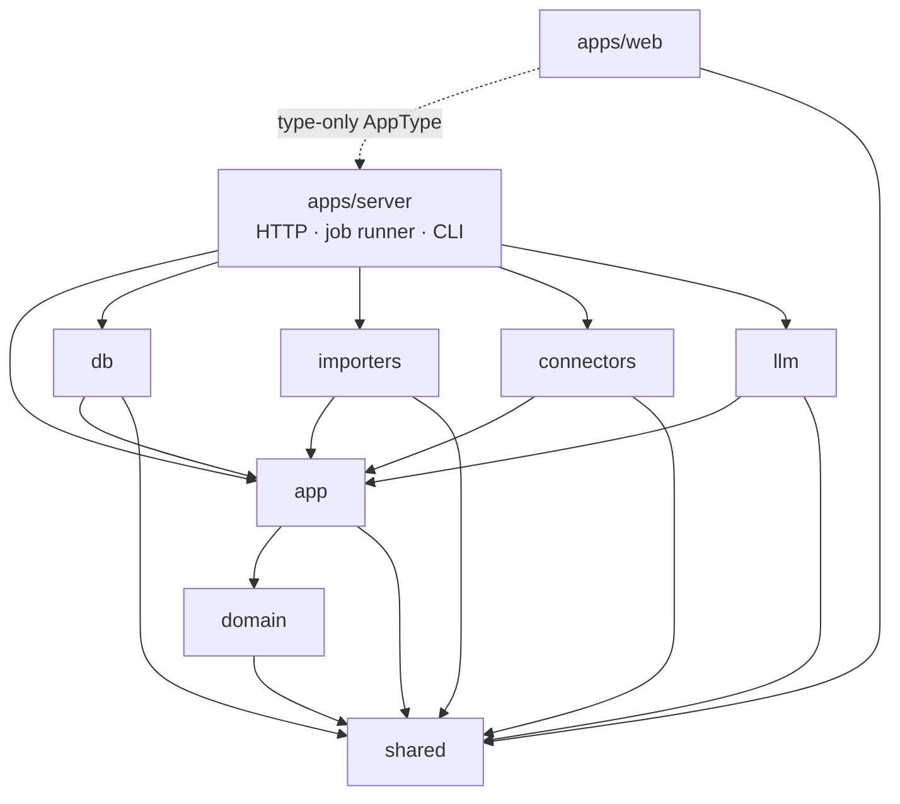
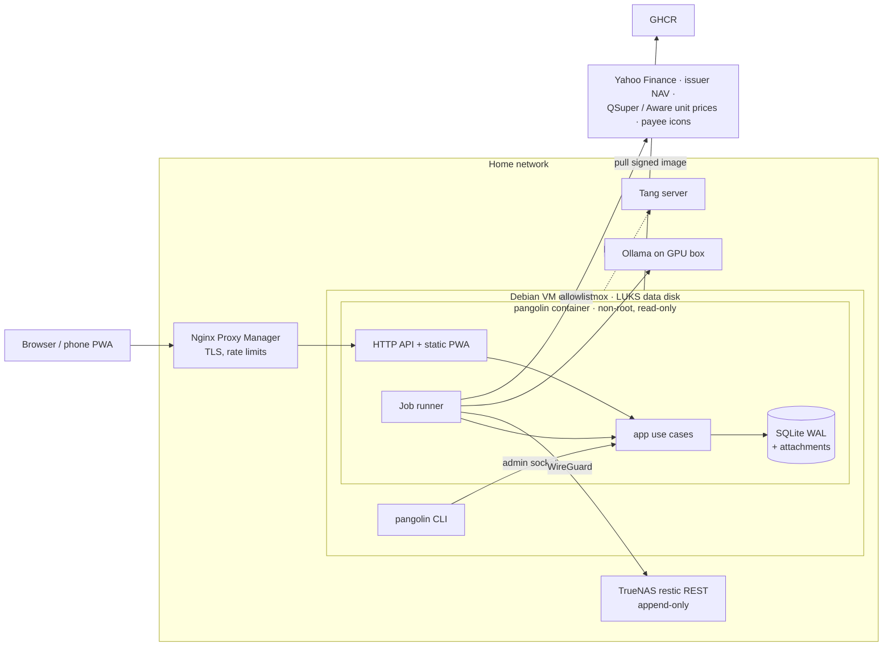
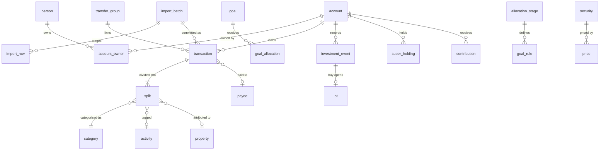

# Architecture Spine — Pangolin Money v1

## Design Paradigm

**Hexagonal, with a functional core.** One Node process, one SQLite writer (both from the spec).

| Ring | Package | Holds | May not |
| --- | --- | --- | --- |
| Core | `packages/shared` | Branded types (`Cents`, `UnitsMicro`, IDs), Zod schemas, money (`allocate`), period and FY maths | Import anything in the repo |
| Core | `packages/domain` | Pure calculations: ledger rules, dedupe, transfer matching, budgets, recurring detection, goal allocation, lots, CGT, forecasts, tax | Do I/O, read the clock, or know about HTTP or SQL |
| Application | `packages/app` | Use cases, one module per area (see AD-10); **port** interfaces; `Viewer`; audit writing | Import any adapter package |
| Adapters | `packages/db`, `importers`, `connectors`, `llm` | Implement `app` ports: repositories and `visibleAccounts()`/`redact()` SQL, file parsers, price fetchers, LLM providers | Call use cases, or import each other |
| Composition roots | `apps/server` (HTTP, job runner), `deploy/` CLI entry | Wire adapters into `app`; construct `Viewer`s | Hold business rules |
| Client | `apps/web` | React PWA | Import runtime code from any package except `shared`; the Hono RPC `AppType` is imported as a type only |

## Invariants & Rules

Arrows point from a package to what it may import. Anything not drawn is forbidden. The rule is enforced by a lint rule on import paths.

### AD-1 — One write path through `app` use cases

- **Binds:** all
- **Prevents:** the HTTP API, job handlers, import commit and the `pangolin` CLI each inventing a write path that skips audit, visibility or validation.
- **Rule:** Only `app` use cases open a write transaction. Each use case writes its `audit_log` rows (entity, id, account_id?, action, before, after, actor) in the same transaction. HTTP routes, job handlers, import commit and CLI commands call use cases and never call repositories directly.

### AD-2 — No `await` inside a write transaction

- **Binds:** all; especially epics 3, 5 and 9
- **Prevents:** write locks held across network or file I/O, and async code running inside a synchronous better-sqlite3 transaction.
- **Rule:** Repository ports are synchronous. Outbound and slow ports (`LlmProvider`, `PriceSource`, `UnitPriceSource`, `LogoFetcher`, PDF text extraction, file reads) are async and are called *before* the transaction opens. A use case does its I/O, then opens one short synchronous transaction to validate, write and audit.

### AD-3 — Visibility is a `Viewer` applied in SQL

- **Binds:** CAP-3, CAP-11, CAP-12, CAP-14, CAP-17, CAP-18; epics 2–5, 9 and 10
- **Prevents:** a report or search filtering in memory after it has already summed, which gives wrong totals or leaks private rows. It also stops each epic defining "household" differently.
- **Rule:**
  - Every use case takes a `Viewer`.
  - **Visibility-scoped tables** are every table with a direct or transitive `account_id`. That includes `transaction`, `split`, `balance_snapshot`, `import_batch`, `import_row`, `recurring_series`, `suggestion`, `investment_event`, `lot`, `super_holding`, `contribution`, `property` (through `loan_account_id`), attachments linked to any of them, `review_item` and `audit_log`, which carries a nullable `account_id`.
  - Every repository read of a scoped table takes the `Viewer` as its first argument. It composes `visibleAccounts(viewer)` as a SQL fragment into the query itself, including aggregates, FTS5 search and exports.
  - Drizzle table objects are not exported outside `packages/db`; a lint rule on import paths enforces this, so no query bypasses the repositories.
  - A viewer's visible accounts are shared and public accounts plus their own private accounts. There is **one** view per viewer, with no separate household lens, so household totals and net worth include the viewer's own private accounts and the two partners may see different household figures (see Terminology).
  - `domain` never queries; it receives rows that are already visible.

### AD-4 — `redact()` once, at the `app` boundary

- **Binds:** CAP-3; epics 2–5, 9 and 10
- **Prevents:** a hidden transaction name escaping through a path someone forgot, such as an export, the audit log, search or a transfer counterpart.
- **Rule:**
  - Every read model leaving `app` passes through `redact(viewer, rows)`: API responses, exports, audit-log reads and job-generated notifications.
  - A hidden name (payee, description, logo) shows as "Hidden until <date>" to the partner, **including in the partner's own audit entries**.
  - Hiding expires at read time (`name_hidden_until > clock.today()`); no job clears it.
  - Hidden names are excluded from the partner's FTS5 search in SQL.
  - When a transfer's counterpart sits in the other partner's private account, the partner sees it as "Transfer from <owner>". This shows who moved the money, not which account it came from or that the account is private. The transfer still counts towards the owner's contribution.

### AD-5 — Private accounts don't exist for the other partner

- **Binds:** CAP-3, CAP-15; epics 2 and 9–10
- **Prevents:** a *forbidden* response revealing that a private account exists, and writes reaching an account that reads would hide.
- **Rule:** When a non-owner addresses a private account, or anything under it, by ID, the result is `NotFound`, for reads and writes alike.

### AD-6 — System access is unreachable from HTTP; LLM data rules are per purpose

- **Binds:** CAP-1, CAP-2; epics 1, 3, 5–7 and 9
- **Prevents:** a route running with unrestricted visibility, jobs working around visibility on their own terms, and private or identifying data reaching a cloud model through some path nobody checked.
- **Rule:**
  - `SystemViewer` sees everything. Only the job-runner and CLI composition roots can construct it.
  - LLM data rules are enforced in the `app` use case that builds each request, never in the provider adapter, and apply whatever the viewer:
    - `categorise` on a cloud provider sends only description, amount, date and the category list. Its few-shot examples (FTS5 matches) come only from non-private accounts. A transaction in a private account is never sent to a cloud provider.
    - `pdf_extract` runs only on a provider marked `is_local`, unless that provider carries an explicit `cloud_pdf` opt-in.
  - The request preview in Settings is produced by the same request builder as the real call.

### AD-7 — Private splits are never shared

- **Binds:** CAP-3, CAP-4, CAP-7, CAP-14; epics 2, 4, 6 and 7
- **Prevents:** shared budgets, savings pools or contribution percentages leaking a private amount, or showing each partner a different "shared" figure.
- **Rule:** A split in a private account has `beneficiary` = the account's owner, enforced by the ledger use case. Every shared figure is computed only from non-private accounts, so it is identical for both partners.

### AD-8 — Jobs: an outbox of idempotent rows

- **Binds:** epics 1, 5, 6, 7 and 9
- **Prevents:** lost follow-up work after a crash, double allocation or double categorisation on retry, and handlers that write around AD-1.
- **Rule:**
  - Jobs are enqueued **inside the business transaction** that causes them.
  - Execution is at least once, so every handler is idempotent.
  - `dedupe_key` is unique among pending and running jobs.
  - A handler does its I/O, then commits through a use case.
  - Each job kind declares a Zod payload schema (checked when enqueued and when run), a retry policy (exponential backoff, then `dead`), a lane, and whether a dead job needs a person.
  - Lanes are `llm`, `net` and `local`. Concurrency per lane is configuration; the default is `llm` = 1. Claiming is atomic with a lease, so it stays correct at any concurrency.
  - Recurring schedules are defined in code, and the runner makes sure the next row for each exists at startup.
  - Backups, restore drills, detection and period close run in the `local` lane.
  - Only handlers in the `net` and `llm` lanes call outbound ports, and only to allowlisted hosts (see the Outbound allowlist convention). Optional SMTP is a `net`-lane port, and message bodies pass through `redact()`.
  - The logo fetcher sends only a bare domain, once per confirmed payee domain, never for a payee visible only through private data, and never when the household setting turns logos off. The browser loads logos only from the app (CSP `img-src 'self'`).

### AD-9 — Async status is read from entities, not jobs

- **Binds:** epics 3, 5 and 9; `apps/web`
- **Prevents:** the UI coupling to job internals, and each epic inventing its own push channel.
- **Rule:**
  - The UI polls the owning entity's status (for example `import_batch.status`) with TanStack Query. It never reads the `job` table. v1 has no server-sent events or websockets.
  - A dead job that needs a person (a failed PDF extraction, backup or restore drill) appears on the status page **and** raises a `review_item` (AD-17). Any other dead job appears on the status page only.

### AD-10 — Every table has one owning module

- **Binds:** all
- **Prevents:** two epics writing the same rows with different rules. For example, rules, the LLM, activity pre-fill and manual edits each setting a split's fields their own way.
- **Rule:**
  - Only the owning `app` module's use cases write a table (see the ownership map below). Other modules read it, or call the owner's use cases.
  - Classifying fields on a split or transaction (`payee_id`, `category_id`, `tax_category_id`, `activity_id`, `beneficiary`, `deductible_bp`) are set only through `ledger.setSplitField(field, value, source)`. It records provenance and never lets a lower-precedence source overwrite a higher one. Precedence is user > rule > payee default > activity default > llm.
  - `suggestion` records its `source` (`llm`, `activity`, `rule_offer`). Tax categories and activities from the LLM are always suggestions and never applied automatically.
  - The import pipeline commits through the owner of each row's target. Transaction rows go to `ledger`. Investment-event rows (added by epic 9, which also owns CMC Invest parsing) go to `invest.recordEvents`.

### AD-11 — Derived on read, with a closed list of stored exceptions

- **Binds:** CAP-4, CAP-5, CAP-6, CAP-8, CAP-9, CAP-17; epics 4 and 6–10
- **Prevents:** stored running totals drifting from the splits, and lot cost bases going stale after a backdated event.
- **Rule:**
  - Balances (AD-19), budgets, reports, contribution shares, forecasts and tax figures are computed from splits and events when read.
  - The only stored derived data is: `goal_allocation`, `lot`, `recurring_series`, `suggestion`, and the frozen boundaries of closed periods.
  - `lot` is a projection, rebuilt from `investment_event` for that account and security in the same transaction as any event write.
  - Period close is idempotent per pool and `period_start`.

### AD-12 — One sign convention

- **Binds:** CAP-1, CAP-8, CAP-9, CAP-11, CAP-17; epics 3, 4 and 8–10
- **Prevents:** importers, reports and forecasts disagreeing about what a negative number means.
- **Rule:**
  - `transaction.amount_cents` is signed from the account's point of view: positive means money in.
  - Balances are signed net-worth values; loans and credit cards are negative.
  - Each import profile's `sign_convention` converts at parse time. No code after parsing flips a sign based on account type.

### AD-13 — Dividing money uses `allocate()`

- **Binds:** CAP-6, CAP-7, CAP-12, CAP-14; epics 2, 4, 7 and 10
- **Prevents:** cents drifting away from the total, which breaks the rule that splits sum to their parent and the savings reconciliation invariant.
- **Rule:** Any division of `Cents` by shares or basis points goes through `shared.allocate(cents, weights)`, which uses the largest-remainder method so the parts always sum exactly. That covers goal shares, contribution apportionment, `deductible_bp`, `share_bp` and suggested splits. Nothing else rounds money.

### AD-14 — Time comes from a Clock; periods come from a pay calendar

- **Binds:** CAP-4, CAP-6, CAP-8, CAP-10, CAP-12; epics 6–8 and 10
- **Prevents:** each epic writing its own fortnight, month and FY maths, tests depending on the real date, and a closed period moving underneath its goal allocation.
- **Rule:**
  - Dates are Temporal `PlainDate`. `domain` never reads the system clock; `app` injects a `Clock` in the household timezone.
  - Periods are half-open `[start, end)` in code and inclusive on screen. A split belongs to the period of its transaction's `posted_on`.
  - An FY is labelled by the year it ends: FY2025 is 2024-07-01 to 2025-06-30.
  - Each pay anchor has an alignment setting:
    - `calendar`: the cadence plus anchor rule. A monthly anchor is a day of the month, clamped to the last day of shorter months.
    - `deposit`: boundaries follow the actual pay deposits detected.
  - `app` works out a `PayCalendar` (the list of period starts) and passes it to `domain`. Future periods always use the calendar rule, with expected paydays rolled back to the previous business day.
  - Once a period has been closed, its boundaries are stored and never recomputed.
  - All period and FY maths lives in `shared/period`, built by epic 1 so that epics 4 and 9 have it before M3.
  - Epic 6 builds pay-deposit detection and `PayCalendar` resolution. Until then, and whenever no deposit has been detected, `calendar` alignment applies.

### AD-15 — Seed modules: deterministic, streamed, through the real pipeline

- **Binds:** all epics; the M0 gate
- **Prevents:** each epic inventing its own synthetic household, adding one epic's data shifting another's, and seed data bypassing the import pipeline that M1 has to prove.
- **Rule:**
  - `tools/seed` holds one world model: people, accounts, pay cycles, merchants and bills.
  - Each epic contributes a `SeedModule { name, dependsOn, generate(world, rng) → { files, expectations } }`.
  - Every run uses a fixed seed and a fixed "today". Each module gets its own random stream derived from its name.
  - Ledger data is written as real OFX, CSV, QIF or PDF files and loaded through the import pipeline. Config-like state (budgets, goals, rules) is created through `app` use cases.
  - Bootstrap: until epic 3's pipeline exists, seed modules create ledger rows through `ledger` use cases with `source: seed`. Epic 3 switches them to emitted files without changing their `expectations`.
  - Tests assert against the emitted `expectations`, never against figures hard-coded in the tests.

### AD-16 — The CLI is never a second writer

- **Binds:** CAP-15, CAP-16; epic 1
- **Prevents:** `pangolin reset-user`, `backup` or `restore` opening SQLite from a second process while the server writes to it.
- **Rule:**
  - While the server runs, CLI commands that read or write data call it over a local admin socket (a Unix socket on the data volume, never exposed through the proxy). The server runs them as `app` use cases under `SystemViewer`.
  - `restore` and `reset-user` for a stopped stack stop the container first, take an exclusive lock on the data directory, and still go through `app` use cases.

### AD-17 — One review inbox, stored

- **Binds:** CAP-2, CAP-5, CAP-7, CAP-10, CAP-18; epics 3 and 5–9
- **Prevents:** each epic inventing its own "needs attention" list, badge count or dismissal state.
- **Rule:**
  - `review_item` (`kind`, `account_id?`, `person_id?`, `entity_ref`, `dedupe_key`, `resolved_at`, `resolution`) is owned by `system`.
  - Epics raise and resolve items only through `system.raiseReviewItem` and `system.resolveReviewItem`. Raising is idempotent on `dedupe_key`.
  - Items are visibility-scoped by `account_id` (AD-3) and redacted (AD-4). Items with no account (a failed backup, for example) are visible to both partners.
  - In-app notifications, such as a partner-assisted reset or a bill alert, are `review_item` kinds, not a separate model.

### AD-18 — Classification rows inherit privacy from their origin

- **Binds:** CAP-2, CAP-3, CAP-13; epics 2, 3, 5 and 10
- **Prevents:** a payee name, logo, alias pattern, rule, tag or activity created from a private transaction revealing it to the partner.
- **Rule:** `payee`, `payee_alias`, `rule`, `tag` and `activity` record `created_from_account_id`. While only private-account data uses a row, only that account's owner can see it. Once it is used on a visible account, it becomes shared.

### AD-19 — One balance definition per account type

- **Binds:** CAP-7, CAP-8, CAP-9, CAP-10, CAP-11, CAP-16, CAP-17; epics 1, 4 and 7–10
- **Prevents:** net worth, savings pools, cash-flow starting points, gearing and the backup manifest each computing an account's balance differently.
- **Rule:** Every balance comes from `accounts.balanceAsOf(viewer, account, date)`:
  - cash, savings, offset, credit card and home loan: the latest `balance_snapshot` on or before the date, plus the splits posted since;
  - brokerage: units from lots × the latest price;
  - super: units × that day's unit price, per option;
  - property and vehicle: the latest valuation snapshot.

  The backup manifest is produced by the same function under `SystemViewer`.

### AD-20 — Import dedupe keys

- **Binds:** CAP-1; epics 3, 5 and 9
- **Prevents:** overlapping OFX, CSV and PDF files for one account double-importing, and a normaliser change silently breaking re-import idempotency.
- **Rule:**
  - Every imported row stores a `fingerprint`, even when it has an `external_id`.
  - There are unique indexes on `(account_id, external_id)` and `(account_id, fingerprint)`. A row is a duplicate if either key matches.
  - Each row stores its `fingerprint_version`. The normaliser for a version is frozen; changing it means a new version, and dedupe also checks earlier versions.
  - `import_batch.file_sha256` is unique per account, and commit is idempotent per batch.

### AD-21 — Attachments are encrypted and inherit visibility

- **Binds:** CAP-1, CAP-12; epics 5 and 10
- **Prevents:** receipts or statements sitting on disk in plain form, and a statement or receipt visible to someone who can't see its transaction.
- **Rule:**
  - Every attachment (statement, receipt, payee logo) is encrypted with the application key and stored at `data/attachments/<sha256>`, deduplicated by hash.
  - An attachment's visibility follows the entity it's linked to.
  - Deleting one goes through a `system` use case that needs re-authentication and warns about the ATO's five-year retention period.
  - Epic 5 builds attachment storage first, for PDF statements and logos.

## Consistency Conventions

| Concern | Convention |
| --- | --- |
| IDs | ULID strings, branded per entity (`AccountId`, `SplitId`…) in `shared` |
| Money and quantities | `Cents` integer (JSON number); units are `UnitsMicro` integers; prices and FX rates are decimal strings handled only with `decimal.js`; never a float |
| Dates and times | Business dates are `YYYY-MM-DD` (`PlainDate`); timestamps are UTC ISO-8601; "today" always comes from `Clock` |
| Tables | `STRICT`, `foreign_keys = ON`; `snake_case`, singular names; `created_at` and `updated_at` everywhere; `deleted_at` soft delete on user-facing records |
| Terminology | **Public account**: a non-private account, personal or shared. **Shared figure**: an aggregate over `beneficiary = shared` or a shared savings pool; identical for both partners (AD-7). **Household total**: an aggregate over everything the viewer can see; computed per viewer (AD-3) |
| Audit | `actor` is `person:<id>`, `job:<kind>` or `cli:<command>`; recovery events, partner-assisted resets and goal-stage changes are audit rows with a named `action` |
| Migrations | Generated by drizzle-kit as SQL, committed, forward-only, applied at startup before the server accepts requests. Foreign keys are switched off around the migration transaction, then `PRAGMA foreign_key_check` must pass before commit. FTS5 tables and triggers are created in migrations. CI applies them to an empty database and to the previous release's database |
| Use cases | `app/<module>/<verbOrNoun>.ts`, signature `(ctx: { viewer, clock, tx… }, input) → output`; input parsed with Zod |
| API | Hono routes under `/api/<module>/…`, consumed through Hono's typed RPC client; bodies validated with Zod |
| Errors | Throw typed `AppError` with a stable `code` (`NotFound`, `Validation`, `Conflict`, `Unauthenticated`, `ReauthRequired`, `RateLimited`); HTTP maps the code to a status; JSON shape is `{ error: { code, message, details? } }` |
| Re-authentication | Exports, token or provider changes, deletes and partner-assisted reset need a fresh passkey or TOTP; enforced in the use case, not the route |
| Web and HTTP security | Strict CSP with no inline scripts or styles injected at runtime, and `img-src 'self'`; no raw HTML rendering of descriptions, PDF text or LLM output; Origin check on every write; `X-Forwarded-*` trusted only from the configured proxy IP; `HttpOnly`, `Secure`, `SameSite=Strict` cookies; login rate limiting and lockout in the app (the `RateLimited` code) |
| Outbound allowlist | One config artefact lists allowed hosts (price and unit-price hosts, the configured LLM `base_url`, TrueNAS, optional SMTP). Code checks it, and `install.sh` generates the firewall rules from it. Changing an LLM `base_url` needs re-authentication and prints the firewall change needed. Logo fetches go only to confirmed payee domains |
| Logging | Structured JSON; tokens, amounts and descriptions redacted by default; no third-party error tracking |
| Config and secrets | Environment variables parsed by one Zod schema at startup; application encryption key read from a key file outside the database; LLM keys encrypted at rest and never sent to the browser |
| Frontend state | Server state only in TanStack Query; filters and paging in URL search params (TanStack Router); the web app never sums money, and every total comes from the server |
| Exports | CSV cells starting with `=`, `+`, `-` or `@` are prefixed; exports go through `redact()` |
| Tests | Domain unit tests take plain values; use-case tests run on a real in-memory SQLite database; every format ships an anonymised sample; e2e runs on seed data with mock LLM and price servers, fully offline |

## Stack

Verified against the npm registry and nodejs.org on 2026-09-27.

| Name | Version |
| --- | --- |
| Node.js | 26 (LTS from 2026-10-28); `.nvmrc` and the image base follow |
| TypeScript | `typescript` ~6.0 (compiler API for tooling); TypeScript 7.0 native checker for CI type-checks |
| pnpm | 12 (`packageManager` field) |
| Hono | 4.13 |
| better-sqlite3 | 13 (N-API) |
| Drizzle ORM / drizzle-kit | 1.0 release candidate (pinned exactly; move to 1.0 final when it ships) |
| Zod | 4 |
| better-auth | 1.7, plus `@better-auth/passkey` 1.7 (separate package); TOTP from the core two-factor plugin |
| React | 19.3 |
| Vite | 8 |
| TanStack Query / Router / Table / Virtual | 5 / 1 / 9 / 3 |
| Tailwind CSS / shadcn CLI | 4 / 4 |
| Apache ECharts | 6 |
| decimal.js | 10 |
| Temporal | native in Node 26 on the server; `temporal-polyfill` 1.0 in the browser |
| pdfjs-dist | 6 |
| Vitest / Playwright | 5 / 1.63 |
| Biome | 2 |
| restic / rest-server | 0.19 / 0.14 (`--append-only`) |
| Docker Compose / cosign | v5 / v3.1.3 or later |
| Host OS | Debian 13 (primary), Ubuntu 24.04 LTS, Rocky Linux 9 |

## Structural Seed

### Context and deployment

The environments are the **live server**, **local development** and **CI**. Development and CI run the same image on seed data, with the mock LLM and mock price servers and no outbound network. Bundled Caddy and Tailscale-only are alternatives to NPM, selected when installing. The outbound allowlist is enforced by the host firewall as well as in code.

### Module ownership (AD-10)

| `app` module | Owns (writes) |
| --- | --- |
| `identity` | better-auth tables, `person`, recovery codes, re-enrolment links |
| `accounts` | `institution`, `account`, `account_owner`, `balance_snapshot` |
| `ledger` | `transaction`, `split`, `transfer_group`, `split_tag`, `transaction_attachment` |
| `classify` | `category_group`, `category`, `tag`, `payee`, `payee_alias`, `rule`, `activity`, `suggestion`, `tax_category` |
| `imports` | `import_profile`, `import_batch`, `import_row` |
| `planning` | `pay_anchor` (per person and household, with alignment), `budget`, `recurring_series`, `goal`, `goal_rule`, `goal_allocation`, `allocation_stage`, `goal_link`, `stage_event`, closed-period boundaries, `forecast_assumption` |
| `invest` | `security`, `investment_event`, `lot`, `price`, `distribution_component` |
| `super` | `super_option`, `super_holding`, `unit_price`, `contribution` |
| `property` | `property` |
| `tax` | WFH hours log, depreciable assets |
| `system` | `job`, `review_item`, `audit_log` (appended by every use case through `system.audit`), `household_settings`, `fy_config` (caps, thresholds, rates per FY), `llm_provider`, `attachment` |

Insight, forecasting and tax-pack reports are read-only query modules. Beyond the rows above, they own no tables.

### Core entities

The full table catalogue is in the spec's `data-model.md`; the code owns it once the code exists.

### Source tree

The spec's `tech-stack.md` repo layout, plus `packages/app/` (use-case modules as above and `ports/`) and `packages/shared/period/` for AD-14.

## Capability → Architecture Map

| Capability | Lives in | Governed by |
| --- | --- | --- |
| CAP-1 import | `importers`, `app/imports`, `domain` dedupe | AD-1, AD-2, AD-8, AD-12, AD-15, AD-20, AD-21 |
| CAP-2 categorisation | `app/classify`, `app/ledger`, `llm` | AD-6, AD-8, AD-10, AD-17, AD-18 |
| CAP-3 privacy | `db` (`visibleAccounts`, `redact`), `app` boundary | AD-3, AD-4, AD-5, AD-7, AD-18 |
| CAP-4 budgets, CAP-5 bills | `app/planning`, `domain` | AD-7, AD-11, AD-14, AD-17 |
| CAP-6 goals, CAP-7 reconciliation | `app/planning`, `domain` | AD-7, AD-8, AD-11, AD-13, AD-14, AD-17, AD-19 |
| CAP-8 forecasting | read-only `forecast` queries, `domain` | AD-11, AD-12, AD-14, AD-19 |
| CAP-9 lots, CAP-10 super | `app/invest`, `app/super`, `connectors` | AD-2, AD-8, AD-10, AD-11, AD-19 |
| CAP-11 property | `app/property`, reports | AD-3, AD-5, AD-19 |
| CAP-12 tax pack | read-only `tax` queries, `app/tax`, `domain` | AD-3, AD-4, AD-13, AD-14, AD-21 |
| CAP-13 activities | `app/classify`, reports | AD-10, AD-18 |
| CAP-14 shared spending | `app/ledger` (beneficiary), reports | AD-7, AD-13 |
| CAP-15 auth and recovery | `app/identity`, better-auth | AD-5, AD-6, AD-16 |
| CAP-16 install and DR | `deploy/`, `system` jobs | AD-8, AD-9, AD-16, AD-19 |
| CAP-17 insight | read-only report queries | AD-3, AD-11, AD-12, AD-19 |
| CAP-18 ledger workspace | `apps/web`, `app/ledger` | AD-3, AD-4, AD-9, AD-17 |

## Deferred

| Item | Why it can wait |
| --- | --- |
| Australian public holidays in payday roll-back | Weekends only in v1; add a holiday calendar to `shared/period` when a missed payday shows up |
| Push channel (server-sent events) | Polling is fine at two users (AD-9) |
| Multi-currency | v1 requires account currency = base currency; the ledger is already currency-agnostic |
| Partner settlement | v1.1; AD-7 and AD-13 already give it clean shared figures |
| Logging library and HTTP middleware choice | Epic 1 picks them within the Logging convention |
| Interest/principal split, Monte Carlo, Betashares statement parsing, bank APIs | Spec non-goals; the connector port stays open |
| Application-level database encryption (SQLCipher) | Host disk encryption per the spec; revisit only for shared hosting |
| Drizzle 1.0 final | The release candidate is pinned exactly; move when 1.0 ships (migrations are committed SQL, so the move is contained) |
| Ubuntu 26.04 and Rocky Linux 10 as supported hosts | Both are current releases; add them to `install.sh` after Debian 13 is proven (Rocky 10 needs x86-64-v3 CPUs) |
| `node:sqlite` in place of better-sqlite3 | Stable in Node 26, but better-sqlite3 13 works and is what the spec chose; revisit with Drizzle 1.0 final |
