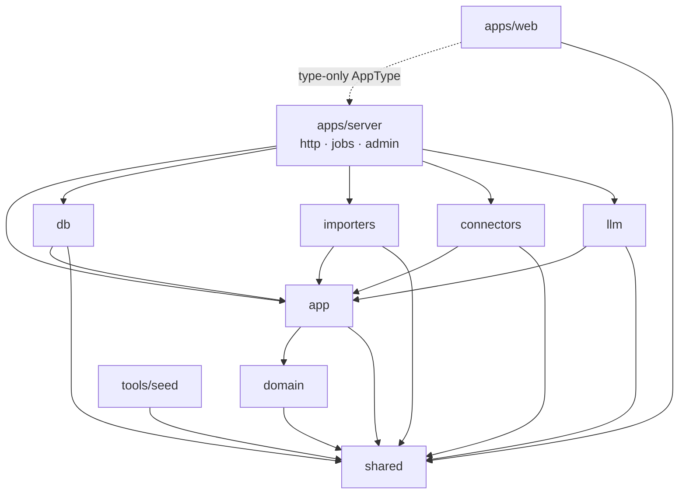
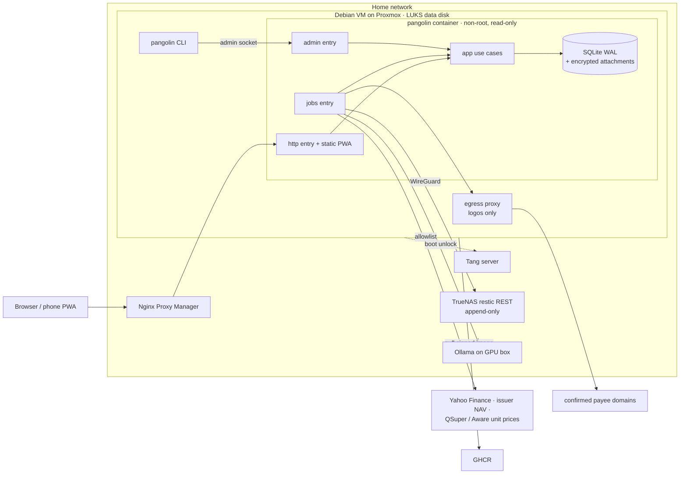

# Architecture Spine — Pangolin Money v1

The spec and its companions remain the contract for *what* each feature does. This spine fixes only the rules that keep separately built epics compatible.

## Design Paradigm

**Hexagonal, with a functional core.** One Node process, one SQLite writer (both from the spec).

| Ring | Package | Holds | May not |
| --- | --- | --- | --- |
| Core | `packages/shared` | Branded types (`Cents`, `UnitsMicro`, IDs), Zod schemas, money (`allocate`, `toCents`), period and FY maths, `shared/temporal` | Import anything in the repo |
| Core | `packages/domain` | Pure calculations: dedupe, transfer matching, `flowKind`, budgets, recurring detection, goal allocation, lots, CGT, forecasts, tax | Do I/O, read the clock, or know about HTTP or SQL |
| Application | `packages/app` | Use cases, one module per area (see the ownership map); port interfaces; `Viewer`; audit writing | Import any adapter package |
| Adapters | `packages/db`, `importers`, `connectors`, `llm` | Implement `app` ports: repositories and the visibility SQL, file parsers, price fetchers, LLM providers | Call use cases, or import each other |
| Composition roots | `apps/server` (`http/`, `jobs/`, `admin/` entries) | Wire adapters into `app`; construct `Viewer`s | Hold business rules |
| Client | `apps/web` | React PWA | Import runtime code from any package except `shared`; the Hono RPC `AppType` is imported as a type only |

## Invariants & Rules

Arrows point from a package to what it may import. Anything not drawn is forbidden. The rule is enforced by a lint rule on import paths.

### AD-1 — One write path through `app` use cases

- **Binds:** all
- **Prevents:** the HTTP API, job handlers, import commit and the CLI each inventing a write path that skips audit, visibility or validation.
- **Rule:**
  - Only `app` use cases open a write transaction.
  - Each use case writes its `audit_log` rows (entity, id, `account_id?`, `person_id?`, action, before, after, actor) in the same transaction.
  - HTTP routes, job handlers, import commit and admin commands call use cases and never call repositories directly.
  - better-auth's own writes are audited through `identity` hooks.
  - The single exception is `restore` (AD-16).

### AD-2 — No `await` inside a write transaction

- **Binds:** all; especially epics 3, 5 and 9
- **Prevents:** write locks held across network or file I/O, and async code running inside a synchronous better-sqlite3 transaction.
- **Rule:** Repository ports are synchronous. Outbound and slow ports (`LlmProvider`, `PriceSource`, `UnitPriceSource`, `LogoFetcher`, `Mailer`, PDF text extraction, file reads and writes) are async and are called *before* the transaction opens. A use case does its I/O, then opens one short synchronous transaction to validate, write and audit.

### AD-3 — Visibility is a `Viewer` applied in SQL

- **Binds:** CAP-3, CAP-11, CAP-12, CAP-14, CAP-17, CAP-18; epics 2–10
- **Prevents:** a report or search filtering in memory after it has already summed, which gives wrong totals or leaks private rows. It also stops each epic defining "household" differently.
- **Rule:**
  - Every use case takes a `Viewer` whose fields are all required.
  - **Account-scoped tables** are every table with a direct or transitive `account_id`: `transaction`, `split`, `balance_snapshot`, `import_batch`, `import_row`, `recurring_series`, `suggestion`, `investment_event`, `lot`, `super_holding`, `contribution`, linked attachments, `review_item` and `audit_log`.
  - `property` takes the scope of its loan account. With no loan account, it takes the scope of its owner.
  - Person-scoped rows follow AD-22.
  - Every repository read of a scoped table takes the `Viewer` first. It composes `visibleAccounts(viewer)`, a raw SQL fragment that throws when given no viewer, into the query itself, including aggregates, FTS5 search and exports.
  - Drizzle table objects are not exported outside `packages/db`. A lint rule enforces this, and one test per scoped table proves a missing viewer throws.
  - A viewer's visible accounts are the public accounts plus their own private accounts. There is **one** view per viewer, with no separate household lens, so household totals may differ between the two partners (see Terminology).
  - `domain` never queries; it receives rows that are already visible.

### AD-4 — Hidden names are removed in SQL; `redact()` formats at the boundary

- **Binds:** CAP-3; epics 2–5, 9 and 10
- **Prevents:** a hidden transaction name escaping through filtering, grouping, sorting, search, rule matching, previews, recurring series, receipts, exports or the audit log.
- **Rule:**
  - Transactions are read through `visibleTxn(viewer)`, a SQL projection that sets payee, description and logo to null for the partner while `name_hidden_until > clock.today()`. Every filter, `GROUP BY`, `ORDER BY`, FTS5 search, rule or alias evaluation, and match-count preview runs on that projection.
  - `redact(viewer, rows)` runs once at the `app` boundary on everything leaving it: API responses, exports, audit-log reads and review items. It renders the placeholder "Hidden until <date>", including in the partner's own audit entries.
  - Attachments on a hidden transaction stay hidden from the partner until the hiding expires.
  - Hiding expires at read time; no job clears it.
  - A transfer whose counterpart sits in the other partner's private account shows as "Transfer from <owner>". The partner can still infer the account exists by elimination; that residual is accepted.

### AD-5 — Private accounts don't exist for the other partner

- **Binds:** CAP-3, CAP-15; epics 2 and 9–10
- **Prevents:** responses and IDs revealing that a private account or its rows exist.
- **Rule:**
  - When a non-owner addresses a private account, or anything under it, by ID, the result is `NotFound`, for reads and writes alike.
  - IDs are generated only on the server, never accepted from a client.

### AD-6 — System access is unreachable from HTTP; LLM data rules are per purpose

- **Binds:** CAP-1, CAP-2; epics 1, 3, 5–7 and 9
- **Prevents:** a route running with unrestricted visibility, and private or identifying data reaching any model through a path nobody checked.
- **Rule:**
  - `SystemViewer` sees everything. Its factory is exported only to `apps/server/src/jobs/**` and `apps/server/src/admin/**`, and a lint rule bans it under `http/**`.
  - Jobs run as `SystemViewer`. Anything they write that a person will see takes the scope of its inputs (AD-22).
  - LLM data rules are enforced in the `app` use case that builds each request, never in the adapter:
    - Few-shot examples come only from accounts visible to *every* viewer of the target transaction, whatever the provider.
    - `categorise` on a non-local provider sends only description, amount, date and the category list, and never a transaction from a private account.
    - `pdf_extract` runs only on a local provider unless that provider has an explicit `cloud_pdf` opt-in.
  - A provider is local only when its `base_url` resolves into the configured LAN address ranges; the flag is derived, not typed in. Changing a provider needs re-authentication.
  - The request preview in Settings is produced by the same request builder as the real call.

### AD-7 — Private splits are never shared

- **Binds:** CAP-3, CAP-4, CAP-7, CAP-14; epics 2, 4, 6 and 7
- **Prevents:** shared budgets, savings pools or contribution percentages leaking a private amount, or showing each partner a different shared figure.
- **Rule:**
  - A split in a private account has `beneficiary` = the account's owner, enforced by `ledger`.
  - Every shared figure is computed only from public accounts.
  - Contribution reads only the shared side of a transfer (`performed_by` on the public account's transaction).
  - `accounts.setPrivacy` rejects making an account private while any of its splits are shared. Past shared figures are recomputed on read under the new state.

### AD-8 — Jobs: an outbox of idempotent rows

- **Binds:** epics 1, 5, 6, 7 and 9
- **Prevents:** lost follow-up work after a crash, double effects on retry, and handlers that write around AD-1.
- **Rule:**
  - Jobs are enqueued **inside the business transaction** that causes them.
  - Execution is at least once, so every handler is idempotent. `dedupe_key` is unique among pending and running jobs.
  - A handler does its I/O, then commits through a use case.
  - Each job kind declares a Zod payload schema (checked when enqueued and when run), a retry policy (exponential backoff, then `dead`), a lane, whether it has external effects, and whether a dead job needs a person.
  - Lanes are `llm`, `net` and `local`. Concurrency per lane is configuration; the default is `llm` = 1. Claiming is atomic with a lease.
  - Recurring schedules are defined in code. At startup the runner makes sure the next row for each exists.
  - `local` holds the database snapshot, restore drill, detection and period close; it never calls outbound ports. `net` holds the backup push, price and unit-price fetches, logos and optional SMTP. `llm` holds model calls. Outbound calls go only to hosts on the allowlist.
  - Logo fetches go through the egress proxy (see Outbound allowlist): one `GET` for the bare domain of a confirmed payee, once, and never for a payee visible only through private data.

### AD-9 — Async status is read from entities, not jobs

- **Binds:** epics 3, 5 and 9; `apps/web`
- **Prevents:** the UI coupling to job internals, and each epic inventing its own push channel.
- **Rule:**
  - The UI polls the owning entity's status (for example `import_batch.status`) with TanStack Query. It never reads the `job` table. v1 has no server-sent events or websockets.
  - A dead job that needs a person raises a `review_item` (AD-17). Every dead job appears on the status page with its kind and time only, never its payload or error text.

### AD-10 — Every table has one owning module

- **Binds:** all
- **Prevents:** two epics writing the same rows with different rules.
- **Rule:**
  - Only the owning `app` module's use cases write a table (see the ownership map). Other modules read it, or call the owner's use cases.
  - Classifying fields (`payee_id`, `category_id`, `tax_category_id`, `activity_id`, `beneficiary`, `deductible_bp`) are set only through `ledger.setSplitField(field, value, source)`:
    - It records provenance and never lets a lower-precedence source overwrite a higher one. Precedence is user > rule > payee default > activity default > llm.
    - It closes any open `suggestion` for that field, as accepted or superseded.
  - Split IDs are stable. Editing a split updates it in place, and deleting one removes its dependents explicitly.
  - `suggestion` records its `source` (`llm`, `activity`, `rule_offer`). Tax categories and activities from the LLM are never applied automatically.
  - The import pipeline commits through the owner of each row's target. Transaction rows go to `ledger`. Investment-event rows go to `invest.recordEvents`; epic 9 adds that target and owns CMC Invest parsing.
  - `fy_config` is one row per (FY, key) with a typed value. Epics 9 and 10 each add keys; neither adds a table for per-FY settings.

### AD-11 — Derived on read, with a closed list of stored exceptions

- **Binds:** CAP-4 to CAP-10, CAP-17; epics 4 and 6–10
- **Prevents:** stored totals drifting from the splits, stale cost bases after a backdated event, and closed periods changing underneath their allocations.
- **Rule:**
  - Balances (AD-19), budgets, reports, contribution shares, forecasts and tax figures are computed when read.
  - The stored derived data is:
    - `goal_allocation`, `goal.completed_at` and `stage_event`;
    - `lot`, `recurring_series` and `suggestion`;
    - `review_item` and the `needs_review` flag;
    - `import_batch` counts, FTS5 indexes and closed-period boundaries.

    Anything new must be added here.
  - Every condition-based review item (over-commitment, mismatch, a missed bill) is re-evaluated by its owning module's check, which resolves it when the condition clears.
  - `lot` is a projection keyed by `buy_event_id`, rebuilt from `investment_event` for that account and security in the same transaction as any event write. A sell event stores its parcel selections by `buy_event_id`, so rebuilds keep them.
  - Closed periods are immutable. A backdated import or edit that changes a closed period's savings produces an audited adjustment in the current period's buffer. It never rewrites a past `goal_allocation`.
  - Period close is idempotent per pool and `period_start`.

### AD-12 — One sign convention

- **Binds:** CAP-1, CAP-8, CAP-9, CAP-11, CAP-17; epics 3, 4 and 8–10
- **Prevents:** importers, reports and forecasts disagreeing about what a negative number means.
- **Rule:**
  - `transaction.amount_cents` is signed from the account's point of view: positive means money in.
  - Balances are signed net-worth values; loans and credit cards are negative.
  - Each import profile's `sign_convention` converts at parse time. No code after parsing flips a sign based on account type.

### AD-13 — Money is rounded in exactly two functions

- **Binds:** CAP-6, CAP-7, CAP-9, CAP-10, CAP-12, CAP-14; epics 2, 4 and 7–10
- **Prevents:** cents drifting from their totals, and each epic picking its own rounding.
- **Rule:**
  - Converting a decimal to `Cents` (units × price, the CGT discount, pace and projection, XIRR, interest) goes only through `shared.toCents(decimal)`, which rounds half-even.
  - Dividing `Cents` by shares or basis points goes only through `shared.allocate(cents, weights)`, which uses the largest-remainder method so the parts always sum exactly.
  - Nothing else rounds money.

### AD-14 — Time comes from a Clock; periods come from a pay calendar

- **Binds:** CAP-4, CAP-6, CAP-8, CAP-10, CAP-12; epics 1, 4 and 6–10
- **Prevents:** each epic writing its own fortnight, month and FY maths; tests depending on the real date; and budgets and goals disagreeing about "this fortnight".
- **Rule:**
  - Dates are Temporal `PlainDate`, imported only from `shared/temporal`. That module uses the native global where it exists and `temporal-polyfill` otherwise. Values cross the wire only as `YYYY-MM-DD` strings.
  - `domain` never reads the system clock; `app` injects a `Clock` in the household timezone.
  - Periods are half-open `[start, end)` in code and inclusive on screen. A split belongs to the period of its transaction's `posted_on`.
  - An FY is labelled by the year it ends: FY2025 is 2024-07-01 to 2025-06-30.
  - Each `pay_anchor` has an alignment setting:
    - `calendar`: cadence plus anchor. A monthly anchor is a day of the month, clamped to the last day of shorter months.
    - `deposit`: boundaries follow the pay deposits detected.
  - `app` resolves a `PayCalendar` per anchor and passes it to `domain`. Budgets and goals in the same pool use the same `PayCalendar`. Future periods always use the calendar rule, with expected paydays rolled back to the previous business day.
  - Once a period has been closed, its boundaries are stored and never recomputed.
  - Epic 1 builds `shared/period` (calendar and FY maths). Epic 6 builds pay-deposit detection and `PayCalendar` resolution. Until then, and whenever no deposit has been detected, `calendar` alignment applies.

### AD-15 — Seed modules: deterministic, streamed, through the real pipeline

- **Binds:** all epics; the M0 gate
- **Prevents:** each epic inventing its own synthetic household, one epic's data shifting another's, contradictory statements for one account, and seed data bypassing the import pipeline M1 has to prove.
- **Rule:**
  - `tools/seed` holds one world model: people, accounts, pay anchors, merchants and bills.
  - Each epic contributes a `SeedModule { name, dependsOn, generate(world, rng) → { events, expectations } }`. Modules add ledger *events* to the world; they never write statement files themselves.
  - The world renders **one statement per account per period**, in that account's formats, from all modules' events.
  - Every run uses a fixed seed and a fixed "today". Each module gets its own random stream derived from its name.
  - Rendered files are loaded through the import pipeline. Config-like state (budgets, goals, rules) is created through `app` use cases.
  - Bootstrap: until epic 3's pipeline exists, the world commits events through `ledger` use cases with `source: seed`. Epic 3 switches to rendered files without changing any module's `expectations`.
  - Tests assert against the emitted `expectations`, never against figures hard-coded in the tests.

### AD-16 — The CLI is never a second writer

- **Binds:** CAP-15, CAP-16; epic 1
- **Prevents:** a CLI command opening SQLite from a second process while the server writes to it, and a restore replaying old external effects.
- **Rule:**
  - While the server runs, CLI commands reach it over an admin Unix socket. The socket sits on a `/run` tmpfs (not the data volume), is mode 0600, and checks the peer's uid. It accepts a fixed set of commands, which the server runs as `app` use cases under `SystemViewer`, audited as `cli:<command>`.
  - `reset-user` on a stopped stack takes an exclusive lock on the data directory and runs the same use case in-process.
  - `restore` is the one exception to AD-1:
    1. stop the stack and take the exclusive lock;
    2. swap in the verified database file and attachments;
    3. before the server accepts work, cancel every pending job with external effects and re-seed the recurring schedules.

### AD-17 — One review inbox, stored

- **Binds:** CAP-2, CAP-5, CAP-7, CAP-10, CAP-18; epics 2, 3 and 5–9
- **Prevents:** each epic inventing its own "needs attention" state, badge count or dismissal rule.
- **Rule:**
  - `review_item` (`kind`, `account_id?`, `person_id?`, `entity_ref`, `dedupe_key`, `resolved_at`, `resolution`) is owned by `system`.
  - Epics raise and resolve items only through `system.raiseReviewItem` and `system.resolveReviewItem`. Raising is idempotent on `dedupe_key`.
  - Each kind is registered once with its owning module, scope and resolution condition. Items resolve when their entity's state changes (AD-11), not only by dismissal.
  - `transaction.needs_review` is maintained by `ledger` from open items and is never set on its own.
  - Visibility follows the item's scope:
    - with `account_id`, the account's scope (AD-3);
    - with `person_id`, only that person;
    - with neither, both partners.
  - Items are redacted (AD-4). In-app notifications (a partner-assisted reset, a bill alert) are review-item kinds.

### AD-18 — Classification rows inherit privacy from their origin

- **Binds:** CAP-2, CAP-3, CAP-13; epics 2, 3, 5 and 10
- **Prevents:** a payee, alias, rule, tag or activity created from private data revealing itself to the partner, or spreading into shared accounts by itself.
- **Rule:**
  - `payee`, `payee_alias`, `rule`, `tag` and `activity` have a scope: the owner-only scope of the account they came from, or shared.
  - Owner-only rows auto-apply only to that owner's private accounts.
  - A row becomes shared only when its owner uses it on a public account. Promotion mints a new ID.
  - Name uniqueness is per scope, so a `Conflict` never reveals an owner-only row.
  - The origin account ID is never serialised.

### AD-19 — One balance definition per account type

- **Binds:** CAP-7, CAP-8, CAP-9, CAP-10, CAP-11, CAP-16, CAP-17; epics 1, 3, 4 and 7–10
- **Prevents:** net worth, savings pools, cash-flow starting points, gearing and the backup manifest each computing a balance differently, and duplicates hiding behind a statement balance.
- **Rule:** Every balance comes from `accounts.balanceAsOf(viewer, account, date)`, always taking the value on or before `date`.

  | Account type | Balance |
  | --- | --- |
  | Cash, savings, offset, credit card, home loan | The latest `balance_snapshot` plus the transactions posted after it. A snapshot's `as_of` includes that whole day. With no snapshot, the opening balance is 0 |
  | Brokerage | Units from lots × the latest price |
  | Super | Units × the latest unit price, per option |
  | Property and vehicle | The latest valuation snapshot |

  - A **snapshot-chain check** (previous snapshot + transactions in between = next snapshot) runs after every import. Any gap raises a `review_item`.
  - The backup manifest lists, per account, the transaction count, Σ `amount_cents` and `balanceAsOf`, all computed under `SystemViewer`.

### AD-20 — Import dedupe keys

- **Binds:** CAP-1; epics 3, 5 and 9
- **Prevents:** overlapping OFX, CSV and PDF files for one account importing a line twice, pending lines duplicating once they post, and a normaliser change breaking re-import idempotency.
- **Rule:**
  - Every `transaction` stores a `fingerprint` and `fingerprint_version`, even when it has an `external_id`.
  - `transaction` has unique indexes on `(account_id, external_id)` and `(account_id, fingerprint)`. A matching key is a certain duplicate.
  - A row matching an existing row on `(account_id, posted_on, amount_cents)` but not on a key is a **probable duplicate**: it goes to review, never commits silently.
  - A pending row is replaced by its posted counterpart, not added beside it.
  - The normaliser for each fingerprint version is frozen. A change means a new version, and dedupe checks all versions.
  - `import_batch.file_sha256` is unique per account, and commit is idempotent per batch.
  - Soft-deleted transactions still count for dedupe, so re-importing a deleted line doesn't bring it back.

### AD-21 — Attachments are encrypted and inherit visibility

- **Binds:** CAP-1, CAP-12; epics 5 and 10
- **Prevents:** receipts or statements sitting on disk in plain form, a file becoming an existence oracle, and an attachment visible to someone who can't see its entity.
- **Rule:**
  - Every attachment (statement, receipt, logo) is encrypted with the application key and stored at `data/attachments/<HMAC(key, content)>`, deduplicated by that name. It is fetched only by the ID of its link row, never by content hash.
  - The file is written before the transaction that links it commits. Orphan files are swept.
  - A backup takes the database snapshot first, then copies the attachments.
  - Visibility follows the linked entity (AD-3, AD-4).
  - Deleting an attachment is a `system` use case that needs re-authentication.
  - Epic 5 builds attachment storage first.

### AD-22 — Derived rows take the most restrictive scope of their inputs

- **Binds:** CAP-3, CAP-4, CAP-6, CAP-7, CAP-12; epics 6–10
- **Prevents:** a personal plan, allocation, tax figure or alert built from private data being shown to the partner because it has no `account_id`.
- **Rule:**
  - Rows scoped to a person (`pay_anchor`, personal `budget`, personal-pool `goal`, `goal_rule`, `goal_allocation`, `stage_event`, the WFH log, depreciable assets, `forecast_assumption`, per-person tax figures) carry `person_id`, and only that person sees them.
  - Shared-pool rows carry no `person_id` and are visible to both.
  - Every derived or job-written row takes the most restrictive scope of its inputs. A row computed from any private account is scoped to that account's owner.
  - A personal-pool review item carries the person's `person_id`.
  - The household pay anchor is an explicit setting, never derived from a partner's deposits.
  - Each person's tax pack is visible only to that person.

### AD-23 — One `flowKind` decides what counts as spending

- **Binds:** CAP-4, CAP-8, CAP-11, CAP-14, CAP-17; epics 3, 4, 6, 8, 9 and 10
- **Prevents:** reports, budgets, forecasts, contribution and property views excluding transfers in different ways.
- **Rule:**
  - Every split has exactly one `flowKind`: `income`, `expense`, `transfer` or `investing`. It is computed by one `domain` function, exposed to SQL as one `db` expression, and used by every aggregate.

    | Split | flowKind |
    | --- | --- |
    | Transfer to or from another of our cash, savings, offset or credit-card accounts (including card repayments) | `transfer` |
    | Repayment into a home-loan account | `expense` (per the spec) |
    | Money into a brokerage or super account | `investing` |
    | A category in a group of kind `transfer`, with no link | `transfer` |
    | Otherwise | `income` if positive, `expense` if negative |

  - Category-group kind is a stable field, so renaming a group never changes flows.
  - Spending, budgets and P&L count only `expense`. Contribution counts transfers into public shared accounts plus shared `expense` paid from personal accounts (AD-7).

### AD-24 — Goals are drawn down only by linked withdrawals

- **Binds:** CAP-6, CAP-7, CAP-13; epics 7 and 10
- **Prevents:** two ways of linking an activity to a goal, and a goal being debited twice, which would break "goals + buffer = savings".
- **Rule:**
  - `goal_link` (owned by `planning`) is the only link from a goal to transactions or activities.
  - A goal's balance goes down only through a linked withdrawal *from its pool's savings account*. Spending on a card or transaction account never debits a goal directly.
  - Period close excludes linked withdrawals when computing new savings.

### AD-25 — One income model

- **Binds:** CAP-5, CAP-8, CAP-10; epics 6, 8 and 9
- **Prevents:** salary counted as both a pay cycle and a recurring series, no owner for expected gross pay, and the forecast double-counting billed categories.
- **Rule:**
  - `pay_anchor` (owned by `planning`) holds each person's cadence, alignment, deposit account, expected net pay and gross salary. The SG check in epic 9 reads gross from here.
  - `recurring_series` has a `direction`. Salary deposits are never recurring series.
  - Forecast = pay anchors (income) + confirmed outgoing series + discretionary budget spend. Each budget has a funding account, which defaults to the scope's pay deposit account. Categories covered by a confirmed series are left out of discretionary spend.
  - SG review items are keyed by (person, pay period start).
  - Epic 9 comes after epic 6 in the build order.

### AD-26 — `poolOf` decides which savings pool an account is in

- **Binds:** CAP-6, CAP-7, CAP-14, CAP-17; epics 2, 4 and 7
- **Prevents:** a jointly owned or private savings account landing in different pools in different epics.
- **Rule:**
  - `accounts.poolOf(account)` returns `shared` when the account has two or more owners, and that person otherwise.
  - A private account has exactly one owner.
  - The payer of a transaction is its `performed_by` person, or the account's sole owner, or `shared` for a joint account.
  - Changing an account's owners or savings flag takes effect from the next open period; closed periods are untouched (AD-11).

### AD-27 — Trust boundary and disaster-recovery secrets

- **Binds:** CAP-15, CAP-16; epic 1
- **Prevents:** a restore onto a new host that can't decrypt receipts, TOTP or backups, and anyone assuming protections the design doesn't give.
- **Rule:**
  - Whoever administers the VM can read everything; privacy between partners holds only inside the app.
  - Partner-assisted reset stays as the spec defines it: a 24-hour link issued by the partner. The issuing partner could redeem it themselves; this residual risk is accepted.
  - `install.sh` produces a **recovery bundle** for offline storage: the application key, auth secret and restic password. `pangolin status` warns until its safe storage is confirmed.
  - CI restores onto a clean host using only the bundle, and proves it by decrypting a sample attachment and logging in with TOTP.

## Consistency Conventions

| Concern | Convention |
| --- | --- |
| Terminology | **Public account**: not private; personal or joint. **Shared figure**: an aggregate over `beneficiary = shared` or the shared pool; identical for both partners. **Household total**: an aggregate over everything the viewer can see; computed per viewer |
| IDs | ULID strings generated on the server, branded per entity (`AccountId`, `SplitId`…) |
| Money and quantities | `Cents` integer (JSON number); units are `UnitsMicro` integers; prices and FX are decimal strings handled only with `decimal.js`; never a float |
| Dates and times | Business dates `YYYY-MM-DD`; timestamps UTC ISO-8601; "today" only from `Clock` |
| Tables | `STRICT` (CI fails if any table isn't), `foreign_keys = ON`; `snake_case`, singular; `created_at`, `updated_at`; soft delete (`deleted_at`) on user-facing records, excluded from every read and report but kept for dedupe (AD-20) |
| Migrations | drizzle-kit generates SQL, reviewed and committed, forward-only. Our own runner applies it: `foreign_keys = OFF` outside the transaction, `BEGIN`, statements, `foreign_key_check` plus the invariant suite, `COMMIT`, `foreign_keys = ON`. FTS5 indexes are keyed on a stable integer, and any table-rebuild migration recreates its triggers and rebuilds the index. CI migrates an empty DB and the previous release's DB |
| Health and upgrade | `/healthz` means migrations applied, database writable and the job-runner lease held. Rollback means the previous image plus the pre-upgrade snapshot; there are never down-migrations. The image is Debian slim (glibc), built for amd64 and arm64 |
| Environments | Live server; local dev (Vite dev server on the same seed and mocks); CI (the release image on seed and mocks, no outbound network); demo mode (the seed, read-only) |
| Use cases | `app/<module>/<name>.ts`; signature `(ctx: { viewer, clock, … }, input) → output`; input parsed with Zod |
| API | Hono routes under `/api/<module>/…`, consumed through Hono's typed RPC client; bodies validated with Zod |
| Errors | Throw typed `AppError` with a stable `code` (`NotFound`, `Validation`, `Conflict`, `Unauthenticated`, `ReauthRequired`, `RateLimited`); HTTP maps it to a status; JSON shape `{ error: { code, message, details? } }`; messages never name another person's private rows |
| Re-authentication | `Viewer.authAt` plus a window per action (default 5 minutes). Enforced in the use case for exports, provider and token changes, deletes and partner-assisted reset |
| Audit | `actor` is `person:<id>`, `job:<kind>` or `cli:<command>`. Audit rows carry the scope of the entity they describe |
| Web security | A nonce-based CSP. Hono inserts a per-request nonce into `index.html` for style elements, and the page shell is never precached by the service worker. No inline scripts. `img-src 'self'`. ECharts uses the canvas renderer with `richText` tooltips. An e2e test fails on any CSP violation. No raw HTML rendering of descriptions, PDF text or LLM output. `X-Forwarded-*` is trusted only from the proxy IP |
| Outbound allowlist | One config artefact lists the allowed hosts: price and unit-price hosts, the LLM `base_url`, TrueNAS, optional SMTP and the egress proxy. Code checks it, and `install.sh` generates the firewall rules from it. Logos go only through the egress proxy, a forward proxy in the Compose stack that allows `GET` to confirmed payee domains. Changing the list needs re-authentication and prints the firewall change |
| Logging | Structured JSON; tokens, amounts and descriptions redacted by default; no third-party error tracking |
| Config and secrets | Environment variables parsed by one Zod schema at startup; the application key is read from a key file outside the database (AD-27); LLM keys are encrypted at rest and never sent to the browser |
| Frontend state | Server state only in TanStack Query; filters and paging in URL search params; the web app never sums money |
| Tests | Domain tests take plain values; use-case tests run on a real SQLite database; every format ships an anonymised sample; e2e runs on the seed, offline. Privacy test: partner B's responses are byte-identical when only partner A's private data changes |

## Stack

Verified against the npm registry and nodejs.org on 2026-09-27.

| Name | Version |
| --- | --- |
| Node.js | 26 (LTS from 2026-10-28); `.nvmrc` and the image base follow |
| TypeScript | 7.0 |
| pnpm | 12 |
| Hono | 4.13 |
| better-sqlite3 | 13 |
| Drizzle ORM / drizzle-kit | 0.45 / 0.31 |
| Zod | 4 |
| better-auth | 1.7, plus `@better-auth/passkey` 1.7 |
| React | 19.3 |
| Vite / vite-plugin-pwa | 8 / current, with inline registration off |
| TanStack Query / Router / Table / Virtual | 5 / 1 / 9 / 3 |
| Tailwind CSS / shadcn CLI | 4 / 4 |
| Apache ECharts | 6 |
| decimal.js | 10 |
| Temporal | native global in Node 26; `temporal-polyfill` 1.0 in the browser, both through `shared/temporal` |
| pdfjs-dist | 6 |
| Vitest / Playwright | 5 / 1.63 |
| Biome | 2 |
| restic / rest-server | 0.19 / 0.14 (`--append-only`) |
| Docker Compose / cosign / Renovate | v5 / v3.1.3 or later / 44 |
| Host OS | Debian 13 (primary), Ubuntu 24.04 LTS, Rocky Linux 9 |

## Structural Seed

### Context and deployment

Bundled Caddy and Tailscale-only are alternatives to NPM, selected at install time.

### Module ownership (AD-10)

| `app` module | Owns (writes) |
| --- | --- |
| `identity` | better-auth tables (through its hooks), `person`, recovery codes, re-enrolment links |
| `accounts` | `institution`, `account`, `account_owner`, `balance_snapshot` |
| `ledger` | `transaction`, `split`, `transfer_group`, `split_tag`, `transaction_attachment` |
| `classify` | `category_group`, `category`, `tag`, `payee`, `payee_alias`, `rule`, `activity`, `suggestion`, `tax_category` |
| `imports` | `import_profile`, `import_batch`, `import_row` |
| `planning` | `pay_anchor`, `budget`, `recurring_series`, `goal`, `goal_rule`, `goal_allocation`, `allocation_stage`, `goal_link`, `stage_event`, closed-period boundaries, `forecast_assumption` |
| `invest` | `security`, `investment_event`, `lot`, `price`, `distribution_component` |
| `super` | `super_option`, `super_holding`, `unit_price`, `contribution` |
| `property` | `property` |
| `tax` | WFH hours log, depreciable assets |
| `system` | `job`, `review_item`, `audit_log` (appended by every use case), `household_settings`, `fy_config`, `llm_provider`, `attachment` |

Insight, forecasting and tax-pack reports are read-only query modules.

### Source tree

The spec's `tech-stack.md` repo layout, plus:
- `packages/app/` (use-case modules as above, and `ports/`);
- `packages/shared/period/` and `packages/shared/temporal/`;
- `apps/server/src/{http,jobs,admin}/` entries.

The full table catalogue stays in the spec's `data-model.md` until the code owns it.

## Capability → Architecture Map

| Capability | Lives in | Governed by |
| --- | --- | --- |
| CAP-1 import | `importers`, `app/imports`, `domain` dedupe | AD-1, AD-2, AD-8, AD-12, AD-15, AD-20, AD-21 |
| CAP-2 categorisation | `app/classify`, `app/ledger`, `llm` | AD-6, AD-8, AD-10, AD-17, AD-18 |
| CAP-3 privacy | `db` (`visibleAccounts`, `visibleTxn`), `app` boundary (`redact`) | AD-3, AD-4, AD-5, AD-7, AD-18, AD-22 |
| CAP-4 budgets, CAP-5 bills | `app/planning`, `domain` | AD-7, AD-11, AD-14, AD-17, AD-23, AD-25 |
| CAP-6 goals, CAP-7 reconciliation | `app/planning`, `domain` | AD-11, AD-13, AD-14, AD-17, AD-19, AD-22, AD-24, AD-26 |
| CAP-8 forecasting | read-only `forecast` queries, `domain` | AD-11, AD-12, AD-14, AD-19, AD-23, AD-25 |
| CAP-9 lots, CAP-10 super | `app/invest`, `app/super`, `connectors` | AD-2, AD-8, AD-10, AD-11, AD-13, AD-19, AD-25 |
| CAP-11 property | `app/property`, reports | AD-3, AD-5, AD-19, AD-23 |
| CAP-12 tax pack | read-only `tax` queries, `app/tax`, `domain` | AD-3, AD-4, AD-13, AD-14, AD-21, AD-22 |
| CAP-13 activities | `app/classify`, reports | AD-10, AD-18, AD-24 |
| CAP-14 shared spending | `app/ledger` (beneficiary), reports | AD-7, AD-13, AD-23, AD-26 |
| CAP-15 auth and recovery | `app/identity`, better-auth | AD-5, AD-6, AD-16, AD-27 |
| CAP-16 install and DR | `deploy/`, `system` jobs, `admin` entry | AD-8, AD-9, AD-16, AD-19, AD-27 |
| CAP-17 insight | read-only report queries | AD-3, AD-11, AD-12, AD-19, AD-23 |
| CAP-18 ledger workspace | `apps/web`, `app/ledger` | AD-3, AD-4, AD-9, AD-17 |

## Pending Propagation

These spine decisions contradict text in the spec or epics. Update that text before incepting the affected epic:

| Where | Change |
| --- | --- |
| Spec `data-model.md` (Privacy enforcement), `SPEC.md` CAP-17 success, `investments-super-tax.md` (Investment property), epic 4 Done-when #2 | Remove the separate "shared/household view that excludes private accounts" (AD-3) |
| Spec `data-model.md` (Conventions) | ULIDs are generated on the server only (AD-5) |
| Spec `security-and-recovery.md` (Account recovery) | Record the accepted residual risk of partner-assisted reset (AD-27) |
| Epic 3 (import) | Drop CMC Invest confirmations; they move to epic 9 (AD-10) |
| Epic 6 (budgets and bills) | It no longer owns the period helpers; it owns pay-deposit detection and `PayCalendar` (AD-14) |
| `tickets.toml` | Epic 7 no longer needs epic 6 for period helpers; epic 9 comes after epic 6 (AD-25) |
| Outbound allowlist | Add the Yahoo Finance cookie/crumb handshake hosts |

## Deferred

| Item | Why it can wait |
| --- | --- |
| Australian public holidays in payday roll-back | Weekends only in v1; add a holiday calendar to `shared/period` later |
| Push channel (server-sent events) | Polling is fine at two users (AD-9) |
| Multi-currency | v1 requires account currency = base currency; the ledger is already currency-agnostic |
| Partner settlement | v1.1; AD-7, AD-13 and AD-23 already give it clean shared figures |
| Library picks inside one epic | Logging (epic 1), OFX/QIF parsers (epic 3), ULID library (epic 1), egress proxy (epic 5), PDF-bundle generator (epic 10); the seed's PDF renderer reuses epic 10's generator once it exists |
| Interest/principal split, Monte Carlo, Betashares statement parsing, bank APIs | Spec non-goals; the connector port stays open |
| Application-level database encryption (SQLCipher) | Host disk encryption per the spec; revisit only for shared hosting |
| Drizzle 1.0 | Move once 1.0 final ships; migrations are committed SQL |
| Ubuntu 26.04 and Rocky Linux 10 as hosts | Add to `install.sh` after Debian 13 is proven |
| `node:sqlite` in place of better-sqlite3 | Revisit with Drizzle 1.0 |
