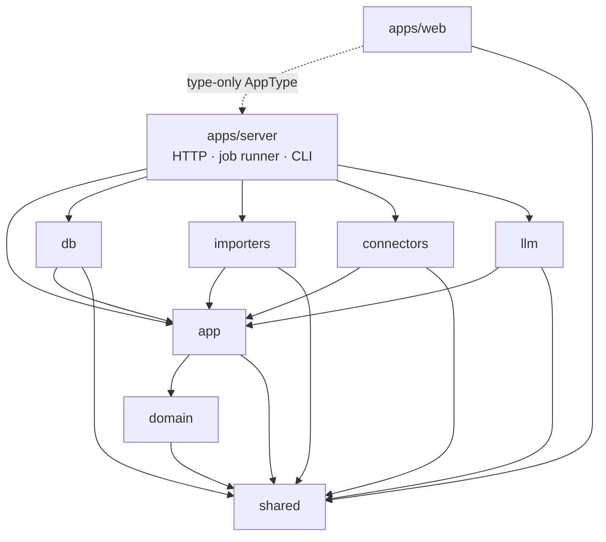
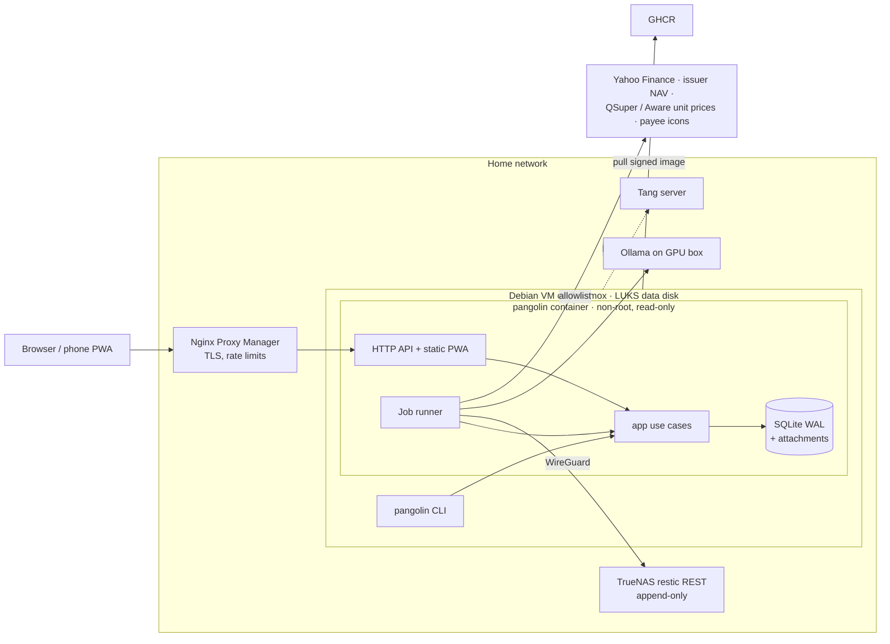
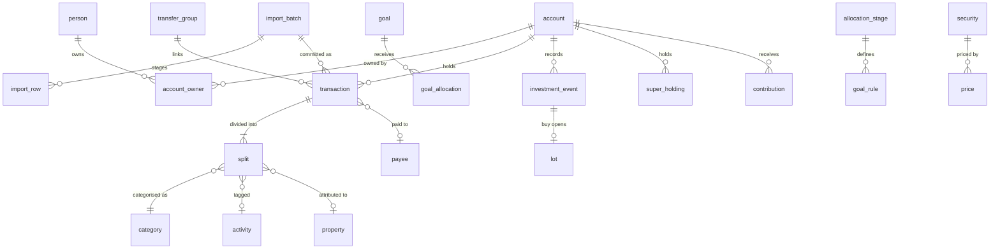

# Architecture Spine — Pangolin Money v1

## Design Paradigm

**Hexagonal, with a functional core.** One Node process, one SQLite writer (both from the spec).

| Ring | Package | Holds | May not |
| --- | --- | --- | --- |
| Core | `packages/shared` | Branded types (`Cents`, `UnitsMicro`, IDs), Zod schemas, money (`allocate`), period and FY maths | Import anything in the repo |
| Core | `packages/domain` | Pure calculations: ledger rules, dedupe, transfer matching, budgets, recurring detection, goal allocation, lots, CGT, forecasts, tax | Do I/O, read the clock, or know about HTTP or SQL |
| Application | `packages/app` | Use cases, one module per area (see AD-10); **port** interfaces; `Viewer`; audit writing | Import any adapter package |
| Adapters | `packages/db`, `importers`, `connectors`, `llm` | Implement `app` ports: repositories and `visibleAccounts()`/`redact()` SQL, file parsers, price fetchers, LLM providers | Call use cases, or import each other |
| Composition roots | `apps/server` (HTTP, job runner), `deploy/` CLI entry | Wire adapters into `app`; construct `Viewer`s | Hold business rules |
| Client | `apps/web` | React PWA | Import runtime code from any package except `shared`; the Hono RPC `AppType` is imported as a type only |

## Invariants & Rules

Arrows point from a package to what it may import. Anything not drawn is forbidden. The rule is enforced by a lint rule on import paths.

### AD-1 — One write path through `app` use cases

- **Binds:** all
- **Prevents:** the HTTP API, job handlers, import commit and the `pangolin` CLI each inventing a write path that skips audit, visibility or validation.
- **Rule:** Only `app` use cases open a write transaction. Each use case writes its `audit_log` rows (entity, id, action, before, after, actor) in the same transaction. HTTP routes, job handlers, import commit and CLI commands call use cases and never call repositories directly.

### AD-2 — No `await` inside a write transaction

- **Binds:** all; especially epics 3, 5 and 9
- **Prevents:** write locks held across network or file I/O, and async code running inside a synchronous better-sqlite3 transaction.
- **Rule:** Repository ports are synchronous. Outbound and slow ports (`LlmProvider`, `PriceSource`, `UnitPriceSource`, `LogoFetcher`, PDF text extraction, file reads) are async and are called *before* the transaction opens. A use case does its I/O, then opens one short synchronous transaction to validate, write and audit.

### AD-3 — Visibility is a `Viewer` applied in SQL

- **Binds:** CAP-3, CAP-11, CAP-12, CAP-14, CAP-17, CAP-18; epics 2–5, 9 and 10
- **Prevents:** a report or search filtering in memory after it has already summed, which gives wrong totals or leaks private rows. It also stops each epic defining "household" differently.
- **Rule:**
  - Every use case takes a `Viewer`.
  - Every repository read of `account`, or of anything under it (transaction, split, balance, holding, event, contribution, attachment), takes the `Viewer` as its first argument. It composes `visibleAccounts(viewer)` as a SQL fragment into the query itself, including aggregates, FTS5 search and exports.
  - A viewer's visible accounts are shared and public accounts plus their own private accounts. There is **one** view per viewer, with no separate household lens, so household totals and net worth include the viewer's own private accounts and the two partners may see different household figures.
  - `domain` never queries; it receives rows that are already visible.

### AD-4 — `redact()` once, at the `app` boundary

- **Binds:** CAP-3; epics 2–5, 9 and 10
- **Prevents:** a hidden transaction name escaping through a path someone forgot, such as an export, the audit log, search or a transfer counterpart.
- **Rule:**
  - Every read model leaving `app` passes through `redact(viewer, rows)`: API responses, exports, audit-log reads and job-generated notifications.
  - A hidden name (payee, description, logo) shows as "Hidden until {date}" to the partner, **including in the partner's own audit entries**.
  - Hiding expires at read time (`name_hidden_until > clock.today()`); no job clears it.
  - Hidden names are excluded from the partner's FTS5 search in SQL.
  - When a transfer's counterpart sits in the other partner's private account, the partner sees it as "Private account ({owner})", with no name or balance.

### AD-5 — Private accounts don't exist for the other partner

- **Binds:** CAP-3, CAP-15; epics 2 and 9–10
- **Prevents:** a *forbidden* response revealing that a private account exists, and writes reaching an account that reads would hide.
- **Rule:** When a non-owner addresses a private account, or anything under it, by ID, the result is `NotFound`, for reads and writes alike.

### AD-6 — System access is not reachable from HTTP

- **Binds:** epics 1, 5–7 and 9
- **Prevents:** a route running with unrestricted visibility, and jobs working around visibility on their own terms.
- **Rule:**
  - `SystemViewer` sees everything. Only the job-runner and CLI composition roots can construct it.
  - Cloud-LLM data minimisation is a separate rule of the LLM purpose, applied whatever the viewer. A cloud provider receives only description, amount, date and the category list, and never a transaction in a private account.

### AD-7 — Private splits are never shared

- **Binds:** CAP-3, CAP-4, CAP-7, CAP-14; epics 2, 4, 6 and 7
- **Prevents:** shared budgets, savings pools or contribution percentages leaking a private amount, or showing each partner a different "shared" figure.
- **Rule:** A split in a private account has `beneficiary` = the account's owner, enforced by the ledger use case. Every shared figure is computed only from non-private accounts, so it is identical for both partners.

### AD-8 — Jobs: an outbox of idempotent rows

- **Binds:** epics 1, 5, 6, 7 and 9
- **Prevents:** lost follow-up work after a crash, double allocation or double categorisation on retry, and handlers that write around AD-1.
- **Rule:**
  - Jobs are enqueued **inside the business transaction** that causes them.
  - Execution is at least once, so every handler is idempotent.
  - `dedupe_key` is unique among pending and running jobs.
  - A handler does its I/O, then commits through a use case.
  - Each job kind declares a Zod payload schema (checked when enqueued and when run), a retry policy (exponential backoff, then `dead`), a lane, and whether a dead job needs a person.
  - Lanes are `llm`, `net` and `local`. Concurrency per lane is configuration; the default is `llm` = 1. Claiming is atomic with a lease, so it stays correct at any concurrency.
  - Recurring schedules are defined in code, and the runner makes sure the next row for each exists at startup.
  - Only handlers in the `net` and `llm` lanes call outbound ports, and only to allowlisted hosts.

### AD-9 — Async status is read from entities, not jobs

- **Binds:** epics 3, 5 and 9; `apps/web`
- **Prevents:** the UI coupling to job internals, and each epic inventing its own push channel.
- **Rule:**
  - The UI polls the owning entity's status (for example `import_batch.status`) with TanStack Query. It never reads the `job` table. v1 has no server-sent events or websockets.
  - A dead job that needs a person (a failed PDF extraction, backup or restore drill) appears on the status page **and** as a review-inbox item. Any other dead job appears on the status page only.

### AD-10 — Every table has one owning module

- **Binds:** all
- **Prevents:** two epics writing the same rows with different rules. For example, rules, the LLM and manual edits each setting `split.category_id` their own way.
- **Rule:**
  - Only the owning `app` module's use cases write a table (see the ownership map below). Other modules read it, or call the owner's use cases.
  - Categories are set only through `ledger.categoriseSplit(source: user | rule | payee | llm)`. It records provenance and never lets a lower-precedence source overwrite a higher one (user > rule > payee default > llm).
  - Tax categories and activities from the LLM are always suggestions and never applied automatically.

### AD-11 — Derived on read, with a closed list of stored exceptions

- **Binds:** CAP-4, CAP-5, CAP-6, CAP-8, CAP-9, CAP-17; epics 4 and 6–10
- **Prevents:** stored running totals drifting from the splits, and lot cost bases going stale after a backdated event.
- **Rule:**
  - Balances, budgets, reports, contribution shares, forecasts and tax figures are computed from splits and events when read.
  - The only stored derived data is: `goal_allocation`, `lot`, `recurring_series`, `suggestion`, and the frozen boundaries of closed periods.
  - `lot` is a projection, rebuilt from `investment_event` for that account and security in the same transaction as any event write.
  - Period close is idempotent per pool and `period_start`.

### AD-12 — One sign convention

- **Binds:** CAP-1, CAP-8, CAP-9, CAP-11, CAP-17; epics 3, 4 and 8–10
- **Prevents:** importers, reports and forecasts disagreeing about what a negative number means.
- **Rule:**
  - `transaction.amount_cents` is signed from the account's point of view: positive means money in.
  - Balances are signed net-worth values; loans and credit cards are negative.
  - Each import profile's `sign_convention` converts at parse time. No code after parsing flips a sign based on account type.

### AD-13 — Dividing money uses `allocate()`

- **Binds:** CAP-6, CAP-7, CAP-12, CAP-14; epics 2, 4, 7 and 10
- **Prevents:** cents drifting away from the total, which breaks the rule that splits sum to their parent and the savings reconciliation invariant.
- **Rule:** Any division of `Cents` by shares or basis points goes through `shared.allocate(cents, weights)`, which uses the largest-remainder method so the parts always sum exactly. That covers goal shares, contribution apportionment, `deductible_bp`, `share_bp` and suggested splits. Nothing else rounds money.

### AD-14 — Time comes from a Clock; periods come from a pay calendar

- **Binds:** CAP-4, CAP-6, CAP-8, CAP-10, CAP-12; epics 6–8 and 10
- **Prevents:** each epic writing its own fortnight, month and FY maths, tests depending on the real date, and a closed period moving underneath its goal allocation.
- **Rule:**
  - Dates are Temporal `PlainDate`. `domain` never reads the system clock; `app` injects a `Clock` in the household timezone.
  - Periods are half-open `[start, end)` in code and inclusive on screen. A split belongs to the period of its transaction's `posted_on`.
  - An FY is labelled by the year it ends: FY2025 is 2024-07-01 to 2025-06-30.
  - Each pay anchor has an alignment setting:
    - `calendar`: the cadence plus anchor rule. A monthly anchor is a day of the month, clamped to the last day of shorter months.
    - `deposit`: boundaries follow the actual pay deposits detected.
  - `app` works out a `PayCalendar` (the list of period starts) and passes it to `domain`. Future periods always use the calendar rule, with expected paydays rolled back to the previous business day.
  - Once a period has been closed, its boundaries are stored and never recomputed.
  - All period and FY maths lives in `shared/period`.

### AD-15 — Seed modules: deterministic, streamed, through the real pipeline

- **Binds:** all epics; the M0 gate
- **Prevents:** each epic inventing its own synthetic household, adding one epic's data shifting another's, and seed data bypassing the import pipeline that M1 has to prove.
- **Rule:**
  - `tools/seed` holds one world model: people, accounts, pay cycles, merchants and bills.
  - Each epic contributes a `SeedModule { name, dependsOn, generate(world, rng) → { files, expectations } }`.
  - Every run uses a fixed seed and a fixed "today". Each module gets its own random stream derived from its name.
  - Ledger data is written as real OFX, CSV, QIF or PDF files and loaded through the import pipeline. Config-like state (budgets, goals, rules) is created through `app` use cases.
  - Tests assert against the emitted `expectations`, never against figures hard-coded in the tests.

## Consistency Conventions

| Concern | Convention |
| --- | --- |
| IDs | ULID strings, branded per entity (`AccountId`, `SplitId`…) in `shared` |
| Money and quantities | `Cents` integer (JSON number); units are `UnitsMicro` integers; prices and FX rates are decimal strings handled only with `decimal.js`; never a float |
| Dates and times | Business dates are `YYYY-MM-DD` (`PlainDate`); timestamps are UTC ISO-8601; "today" always comes from `Clock` |
| Tables | `STRICT`, `foreign_keys = ON`; `snake_case`, singular names; `created_at` and `updated_at` everywhere; `deleted_at` soft delete on user-facing records |
| Migrations | Generated by drizzle-kit as SQL, committed, forward-only, applied at startup in one transaction; CI applies them to an empty database and to the previous release's database |
| Use cases | `app/<module>/<verbOrNoun>.ts`, signature `(ctx: { viewer, clock, tx… }, input) → output`; input parsed with Zod |
| API | Hono routes under `/api/<module>/…`, consumed through Hono's typed RPC client; bodies validated with Zod |
| Errors | Throw typed `AppError` with a stable `code` (`NotFound`, `Validation`, `Conflict`, `Unauthenticated`, `ReauthRequired`, `RateLimited`); HTTP maps the code to a status; JSON shape is `{ error: { code, message, details? } }` |
| Re-authentication | Exports, token or provider changes, deletes and partner-assisted reset need a fresh passkey or TOTP; enforced in the use case, not the route |
| Logging | Structured JSON; tokens, amounts and descriptions redacted by default; no third-party error tracking |
| Config and secrets | Environment variables parsed by one Zod schema at startup; application encryption key read from a key file outside the database; LLM keys encrypted at rest and never sent to the browser |
| Frontend state | Server state only in TanStack Query; filters and paging in URL search params (TanStack Router); the web app never sums money, and every total comes from the server |
| Exports | CSV cells starting with `=`, `+`, `-` or `@` are prefixed; exports go through `redact()` |
| Tests | Domain unit tests take plain values; use-case tests run on a real in-memory SQLite database; every format ships an anonymised sample; e2e runs on seed data with mock LLM and price servers, fully offline |

## Stack

Verified against the npm registry and nodejs.org on 2026-09-27.

| Name | Version |
| --- | --- |
| Node.js | 26 (LTS from 2026-10-28); `.nvmrc` and the image base follow |
| TypeScript | `typescript` ~6.0 (compiler API for tooling); TypeScript 7.0 native checker for CI type-checks |
| pnpm | 12 (`packageManager` field) |
| Hono | 4.13 |
| better-sqlite3 | 13 (N-API) |
| Drizzle ORM / drizzle-kit | 1.0 release candidate (pinned exactly; move to 1.0 final when it ships) |
| Zod | 4 |
| better-auth | 1.7, plus `@better-auth/passkey` 1.7 (separate package); TOTP from the core two-factor plugin |
| React | 19.3 |
| Vite | 8 |
| TanStack Query / Router / Table / Virtual | 5 / 1 / 9 / 3 |
| Tailwind CSS / shadcn CLI | 4 / 4 |
| Apache ECharts | 6 |
| decimal.js | 10 |
| Temporal | native in Node 26 on the server; `temporal-polyfill` 1.0 in the browser |
| pdfjs-dist | 6 |
| Vitest / Playwright | 5 / 1.63 |
| Biome | 2 |
| restic / rest-server | 0.19 / 0.14 (`--append-only`) |
| Docker Compose / cosign | v5 / v3.1.3 or later |
| Host OS | Debian 13 (primary), Ubuntu 24.04 LTS, Rocky Linux 9 |

## Structural Seed

### Context and deployment

The environments are the **live server**, **local development** and **CI**. Development and CI run the same image on seed data, with the mock LLM and mock price servers and no outbound network. Bundled Caddy and Tailscale-only are alternatives to NPM, selected when installing. The outbound allowlist is enforced by the host firewall as well as in code.

### Module ownership (AD-10)

| `app` module | Owns (writes) |
| --- | --- |
| `identity` | better-auth tables, `person`, recovery codes, re-enrolment links |
| `accounts` | `institution`, `account`, `account_owner`, `balance_snapshot` |
| `ledger` | `transaction`, `split`, `transfer_group`, `split_tag`, `transaction_attachment` |
| `classify` | `category_group`, `category`, `tag`, `payee`, `payee_alias`, `rule`, `activity`, `suggestion`, `tax_category` |
| `imports` | `import_profile`, `import_batch`, `import_row` |
| `planning` | `budget`, `recurring_series`, `goal`, `goal_rule`, `goal_allocation`, `allocation_stage`, closed-period boundaries |
| `invest` | `security`, `investment_event`, `lot`, `price` |
| `super` | `super_option`, `super_holding`, `unit_price`, `contribution` |
| `property` | `property` |
| `system` | `job`, `audit_log` (appended by every use case through `system.audit`), `household_settings`, `llm_provider`, `attachment` |

Reports (insight, forecasting, tax pack) own no tables; they are read-only query modules.

### Core entities

The full table catalogue is in the spec's `data-model.md`; the code owns it once the code exists.

### Source tree

The spec's `tech-stack.md` repo layout, plus `packages/app/` (use-case modules as above and `ports/`) and `packages/shared/period/` for AD-14.

## Capability → Architecture Map

| Capability | Lives in | Governed by |
| --- | --- | --- |
| CAP-1 import | `importers`, `app/imports`, `domain` dedupe | AD-1, AD-2, AD-8, AD-12, AD-15 |
| CAP-2 categorisation | `app/classify`, `app/ledger`, `llm` | AD-6, AD-8, AD-10 |
| CAP-3 privacy | `db` (`visibleAccounts`, `redact`), `app` boundary | AD-3, AD-4, AD-5, AD-7 |
| CAP-4 budgets, CAP-5 bills | `app/planning`, `domain` | AD-7, AD-11, AD-14 |
| CAP-6 goals, CAP-7 reconciliation | `app/planning`, `domain` | AD-7, AD-8, AD-11, AD-13, AD-14 |
| CAP-8 forecasting | read-only `forecast` queries, `domain` | AD-11, AD-12, AD-14 |
| CAP-9 lots, CAP-10 super | `app/invest`, `app/super`, `connectors` | AD-2, AD-8, AD-11 |
| CAP-11 property | `app/property`, reports | AD-3, AD-5 |
| CAP-12 tax pack | read-only `tax` queries, `domain` | AD-3, AD-4, AD-13, AD-14 |
| CAP-13 activities | `app/classify`, reports | AD-10 |
| CAP-14 shared spending | `app/ledger` (beneficiary), reports | AD-7, AD-13 |
| CAP-15 auth and recovery | `app/identity`, better-auth | AD-5, AD-6 |
| CAP-16 install and DR | `deploy/`, `system` jobs | AD-8, AD-9 |
| CAP-17 insight | read-only report queries | AD-3, AD-11, AD-12 |
| CAP-18 ledger workspace | `apps/web`, `app/ledger` | AD-3, AD-4, AD-9 |

## Deferred

| Item | Why it can wait |
| --- | --- |
| Australian public holidays in payday roll-back | Weekends only in v1; add a holiday calendar to `shared/period` when a missed payday shows up |
| Push channel (server-sent events) | Polling is fine at two users (AD-9) |
| Multi-currency | v1 requires account currency = base currency; the ledger is already currency-agnostic |
| Partner settlement | v1.1; AD-7 and AD-13 already give it clean shared figures |
| Logging library and HTTP middleware choice | Epic 1 picks them within the Logging convention |
| Interest/principal split, Monte Carlo, Betashares statement parsing, bank APIs | Spec non-goals; the connector port stays open |
| Application-level database encryption (SQLCipher) | Host disk encryption per the spec; revisit only for shared hosting |
