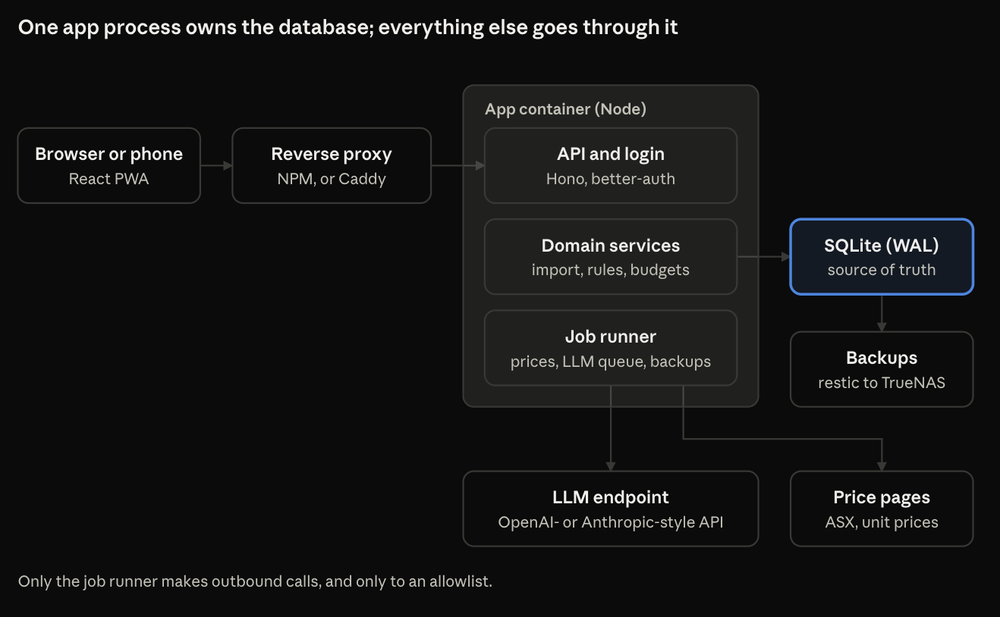
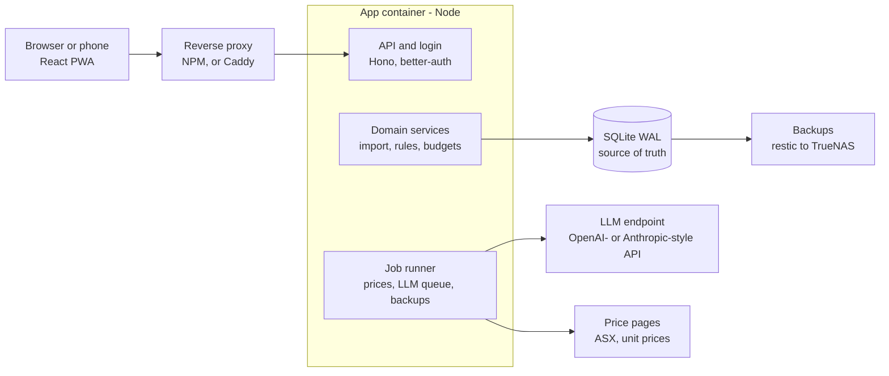
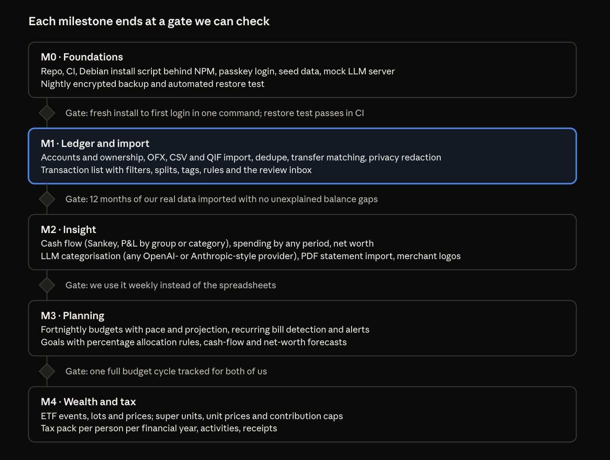

# Architecture diagrams

## System architecture

One app process owns the database; everything else goes through it. Only the job runner makes outbound calls, and only to an allowlist.

## Milestones

See the milestones table in `deployment-and-ops.md` for the text of each milestone and gate.
